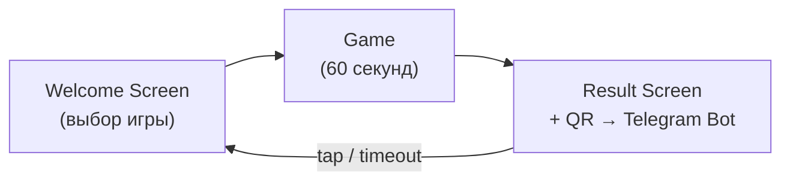
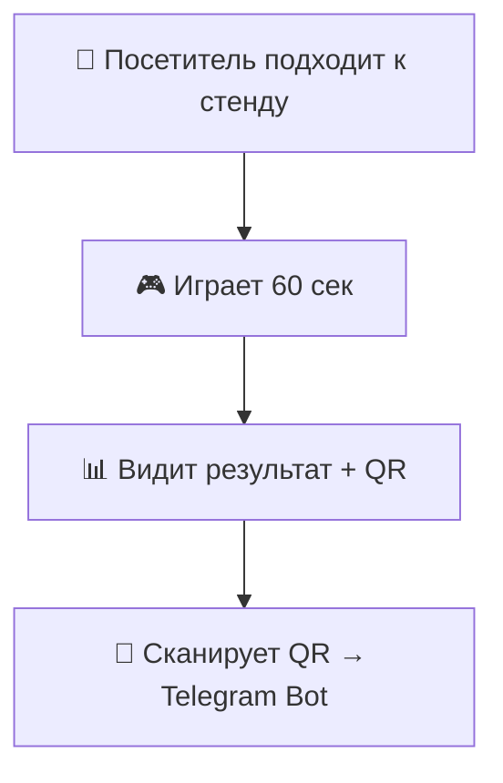

# YAEDU Stand

Выставочный стенд с **2 играми** для образовательной конференции.  
Цель — **сбор воронки**: привлечь игроков, показать результат и перенаправить в Telegram-бота.

---

## Игры

| Игра | Путь | Концепт |
|---|---|---|
| **Anti-Tetris** | `/anti-tetris` | [CONCEPT.md](./src/anti-tetris/CONCEPT.md) |
| **Binary Maze** | `/binary-maze` | _TBD_ |

---

## Общий Игровой Цикл



### 1. Welcome Screen (`/`)
- Экран выбора игры.
- Две кнопки / карточки — по одной на каждую игру.

### 2. Game (60 секунд)
- У каждого игрока изначально **60 секунд**.
- Цель — набрать как можно больше **очков** и/или **рангов** за отведённое время.
- Таймер и логика очков определяются внутри каждой игры отдельно.

### 3. Result Screen (общий для обеих игр)
- Появляется по истечении 60 секунд.
- **Одинаковый** для обеих игр — единый компонент / страница.
- Содержимое:
  - **Итоговый результат** — очки, ранг, уровень и т.д.
  - **QR-код** — ведёт на посадочного Telegram-бота.
  - Через несколько секунд или по тапу → возврат на Welcome Screen.

---

## Воронка



---

## Структура проекта

```
/
├── CONCEPT.md              ← этот файл
├── IMPLEMENTATION.md       ← общие гайдлайны разработки
├── AGENTS.md               ← инструкции для AI агентов
├── src/
│   ├── pages/
│   │   ├── Welcome.vue     ← экран выбора игры
│   │   ├── AntiTetris.vue  ← страница игры Anti-Tetris
│   │   └── BinaryMaze.vue  ← страница игры Binary Maze
│   ├── anti-tetris/        ← модуль игры Anti-Tetris
│   │   └── CONCEPT.md
│   ├── binary-maze/        ← модуль игры Binary Maze
│   │   └── (CONCEPT.md — TBD)
│   ├── router/
│   └── styles/
```

---

## Result Screen — Спецификация

> **Важно:** единый экран результатов для обеих игр.

### Входные данные (props / route params)
- `gameName` — название игры (`'Anti-Tetris'` | `'Binary Maze'`)
- `score` — набранные очки
- `level` — достигнутый уровень
- `rank` — ранг (опционально, зависит от игры)
- `stats` — дополнительная статистика (опционально)

### UI
- Крупный заголовок с результатом.
- Анимированный переход при появлении.
- QR-код в центре / нижней части экрана.
- Текст-призыв: _«Сканируй QR, чтобы продолжить!»_ (или аналог).
- Авто-возврат на Welcome Screen через `RESULT_DISPLAY_DURATION` секунд, либо по тапу.

### Константы

```ts
/** Время показа экрана результатов (секунды) */
export const RESULT_DISPLAY_DURATION = 15;

/** URL для QR-кода (Telegram Bot) */
export const QR_TARGET_URL = 'https://t.me/yaedu_bot';
```
