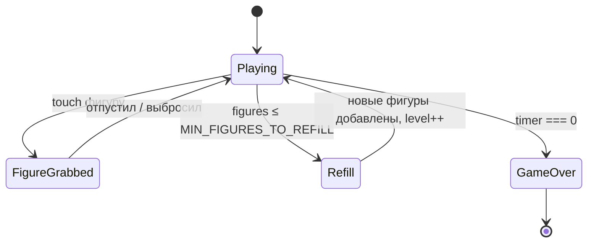

# Anti-Tetris

Физическая головоломка для **тачскрин-стенда** на образовательной конференции.
Игрок вытаскивает фигуры из кучи и выбрасывает их вверх за пределы контейнера, ища совпадение по форме и цвету с целевой фигурой.

---

## Вертикальный Layout

Экран делится на **3 секции** сверху вниз:

| Секция | Назначение |
|---|---|
| Top (Header) | Таймер + целевая фигура |
| Container | Контейнер с фигурами (игровое поле) |
| Footer | Пустой отступ (зона безопасности для жестов ОС) |

---

## Top Section — Таймер & Цель

### Таймер
- Обратный отсчёт `GAME_DURATION` секунд.
- При окончании таймера — **Game Over**.

### Целевая фигура (Target)
- Отображается рядом с таймером.
- Выбирается **случайно** из фигур, _реально существующих_ в контейнере.
- На **1-м уровне** — белая (без цвета), нужно найти совпадение только по **форме**.
- Со **2-го уровня** — цветная, нужно совпадение по **форме + цвету**.

---

## Container — Игровое поле

### Физика
- Фигуры — **rigid bodies** в 2D-физическом мире (`planck`).
- Фигуры лежат кучей на дне контейнера, подчиняясь гравитации.
- Контейнер **открыт сверху** — фигуры можно выбросить вверх.

### Фигуры
- Стандартные тетрис-формы: **I, O, T, S, Z, L, J**.
- Каждая фигура имеет **цвет** (палитра из `FIGURE_COLORS`).
- Фигуры не могут пересекаться (физические столкновения).

### Взаимодействие (Touch)
- Игрок **касается** фигуры, чтобы "схватить" её.
- При захвате к фигуре прикладывается **сила** в направлении пальца.
- **Важно**: нельзя вытащить фигуру из-под других — стопка блокирует.
  Игрок должен сначала **разгрести** мешающие фигуры.
- Чтобы выбросить фигуру — свайп/бросок **вверх**.
- Используется **инерция**: фигура летит по физике после отпускания.
- Если фигура **не целевая** — ускорение вверх затухает быстрее (множитель `WRONG_FIGURE_DRAG`).
  Затухание действует в зоне верхних **1/8 игрового поля** (`DRAG_ZONE_RATIO`),
  не давая нецелевым фигурам легко вылететь.

### Стрелка-подсказка
- В верхней части игрового поля отображается стрелка **↑** с текстом `«кидай вверх»` по обеим сторонам.
- **Исчезает** после первой успешно подкинутой целевой фигуры.

### Пополнение фигур
- Когда в контейнере остаётся `MIN_FIGURES_TO_REFILL` фигур:
  - Платформа на дне **поднимается**, добавляя `FIGURES_PER_REFILL` новых фигур.
  - Уровень увеличивается на **1**.

---

## Монеты (Coins)

- Фигура может содержать **монету** (визуально отображается на фигуре).
- Подбор монеты добавляет `COIN_TIME_BONUS` секунд к таймеру.
- Вероятность появления монеты на фигуре:
  - **Базовая**: `1 / level`
  - **Бонус для 2-й монеты в наборе**: `+COIN_SECOND_BONUS_CHANCE` (10%).

---

## Уровни & Сложность

| Уровень | Целевая фигура | Монеты (шанс) |
|---|---|---|
| 1 | Только **форма** (белая) | 100% |
| 2 | **Форма + цвет** | 50% + 10% бонус |
| 3+ | **Форма + цвет** | `1/level` + 10% бонус |

---

## Подсчёт очков

- За правильно выброшенную целевую фигуру начисляются очки.
- Формула: `POINTS_PER_FIGURE × level`.

---

## Game Over

- Наступает при `timer === 0`.
- Показывается экран результатов: **итоговый счёт**, уровень, количество собранных фигур.

---

## Settings.ts — Константы

Все игровые константы вынесены в отдельный файл `Settings.ts`:

---

## Диаграмма состояний

