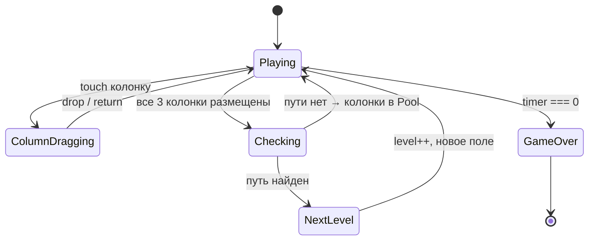

# Binary Maze

Логическая головоломка для **тачскрин-стенда** на образовательной конференции.
Игрок размещает колонки с бинарными числами на поле, чтобы проложить путь из **S** в **E** по клеткам `0`.

---

## Вертикальный Layout

Экран делится на **3 секции** сверху вниз:

| Секция | Доля экрана | Назначение |
|---|---|---|
| Top (Header) | **1/6** | Таймер + текущий уровень |
| Game Field | **3/8** | Сетка 7×5 с бинарными числами |
| Pool | **3/8** | 3 перетаскиваемые колонки |

---

## Top Section — Таймер & Уровень

### Таймер
- Обратный отсчёт `GAME_DURATION` секунд (`60`).
- При окончании — **Game Over**.

### Уровень
- Начинается с `1`.
- Увеличивается на **1** при каждом успешном прохождении раунда.

---

## Game Field — Игровое поле

### Сетка

Поле — `GRID_COLS × GRID_ROWS` (`7×5`) клеток, содержащих `0` или `1`.
Сетка окружена «стеной» толщиной в одну клетку.

```
w w w w w w w w w
S . . . . . . . w
w . . . . . . . w
w . . . . . . . w
w . . . . . . . w
w . . . . . . . E
w w w w w w w w w
```

- **S** (Start) — вход слева, строка `0` (верхний ряд поля).
- **E** (End) — выход справа, строка `GRID_ROWS - 1` (нижний ряд поля).
- **w** — стена, непроходима.
- **.** — клетка поля (содержит `0` или `1`).

### Путь

Путь проходит **только по клеткам `0`**. Допустимые повороты: **0°** и **90°** (без диагоналей).
Путь рассчитывается алгоритмом поиска (BFS / A\*).

### Пустые колонки

При генерации поля `EMPTY_COLUMNS_COUNT` (`3`) случайных колонок **убираются** из сетки и помещаются в **Pool**.
Их места на поле остаются пустыми (визуально выделены).

---

## Pool — Пул колонок

- Содержит `EMPTY_COLUMNS_COUNT` (`3`) перетаскиваемых колонок.
- Каждая колонка — вертикальный набор из `GRID_ROWS` (`5`) клеток с `0`/`1`.
- Колонки отображаются горизонтально (в ряд) под игровым полем.

### Drag & Drop (Touch)

- Игрок **перетаскивает** колонку из Pool и **бросает** на пустое место в сетке.
- Колонку можно перетащить **обратно** из сетки в Pool.
- Визуальная подсветка допустимого места при наведении.

### Проверка пути

- Как только все `EMPTY_COLUMNS_COUNT` колонок размещены на поле:
  - Проверяется существование пути **S → E** по клеткам `0`.
  - **Путь найден** → уровень **+1**, генерируется новое поле.
  - **Пути нет** → все 3 колонки **возвращаются в Pool**, игрок пробует снова.

---

## Генерация поля

### Алгоритм

1. **Инициализация**: для каждой клетки вычислить `v = rand() > r ? 0 : 1`.
   - `r` — порог генерации (чем выше, тем больше `1`).
   - Формула порога: `r = BASE_FILL_RATIO + (level - 1) × FILL_RATIO_STEP`.
   - На 1-м уровне: `r = 0.3`, далее увеличивается на `FILL_RATIO_STEP` (`0.05`) за уровень.
   - Максимальное значение: `MAX_FILL_RATIO` (`0.7`).
2. **Обязательные нули**:
   - Клетка перед **S** (`[0][0]`) — всегда `0`.
   - Клетка перед **E** (`[GRID_ROWS-1][GRID_COLS-1]`) — всегда `0`.
3. **Валидация колонок**: если какая-либо колонка содержит **только один вид** чисел (все `0` или все `1`) — заменить случайную клетку на противоположное значение.
4. **Проверка пути**: после генерации запустить pathfinding (BFS/A\*).
   - Если путь **S → E** существует → поле готово.
   - Если нет → уменьшить `r` на `FILL_RATIO_RETRY_STEP` (`0.01`) и повторить генерацию.
5. **Выбор пустых колонок**: случайно выбрать `EMPTY_COLUMNS_COUNT` (`3`) колонок, убрать из поля в Pool.
   - При выборе убедиться, что после удаления колонок поле, при **любом** размещении этих колонок обратно, хотя бы одна комбинация даёт валидный путь.

---

## Уровни & Сложность

| Уровень | Порог `r` | Описание |
|---|---|---|
| 1 | `0.30` | Мало `1`, путь легко найти |
| 2 | `0.35` | Чуть больше `1` |
| 3 | `0.40` | Средняя сложность |
| … | +`0.05` | Увеличивается каждый уровень |
| 9+ | `0.70` (max) | Максимальная сложность |

---

## Подсчёт очков

- За каждый успешно пройденный раунд: `POINTS_PER_LEVEL × level`.

---

## Game Over

- Наступает при `timer === 0`.
- Показывается экран результатов: **итоговый счёт**, уровень.

---

## Settings.ts — Константы

Все игровые константы вынесены в отдельный файл `Settings.ts`:

```ts
// ─── Grid ──────────────────────────────────────────────
/** Количество колонок в сетке */
export const GRID_COLS = 7;

/** Количество строк в сетке */
export const GRID_ROWS = 5;

// ─── Time ──────────────────────────────────────────────
/** Длительность раунда в секундах */
export const GAME_DURATION = 60;

// ─── Pool ──────────────────────────────────────────────
/** Количество колонок, убираемых из поля в Pool */
export const EMPTY_COLUMNS_COUNT = 3;

// ─── Field Generation ──────────────────────────────────
/** Базовый порог заполнения единицами (1-й уровень) */
export const BASE_FILL_RATIO = 0.3;

/** Шаг увеличения порога за уровень */
export const FILL_RATIO_STEP = 0.05;

/** Максимальный порог заполнения */
export const MAX_FILL_RATIO = 0.7;

/** Шаг уменьшения порога при неудачной генерации */
export const FILL_RATIO_RETRY_STEP = 0.01;

// ─── Scoring ───────────────────────────────────────────
/** Очки за пройденный раунд (× текущий уровень) */
export const POINTS_PER_LEVEL = 100;
```

---

## Диаграмма состояний



---

## Диаграмма Layout

```
┌──────────────────────────────┐
│         ⏱ 00:47              │
│         Level: 3             │  ← Top (1/6)
├──────────────────────────────┤
│  w w w w w w w w w          │
│  S 0 1 _ 0 _ 1 0 w          │
│  w 1 0 _ 1 _ 0 1 w          │
│  w 0 0 _ 0 _ 1 0 w          │  ← Game Field (3/8)
│  w 1 0 _ 1 _ 0 0 w          │
│  w 0 1 _ 0 _ 0 1 E          │
│  w w w w w w w w w          │
├──────────────────────────────┤
│                              │
│  ┌───┐  ┌───┐  ┌───┐        │
│  │ 0 │  │ 1 │  │ 0 │        │
│  │ 1 │  │ 0 │  │ 1 │        │
│  │ 0 │  │ 1 │  │ 0 │        │  ← Pool (3/8)
│  │ 1 │  │ 1 │  │ 0 │        │
│  │ 0 │  │ 0 │  │ 1 │        │
│  └───┘  └───┘  └───┘        │
│                              │
└──────────────────────────────┘
```

- `_` — пустое место (колонка была убрана в Pool).
